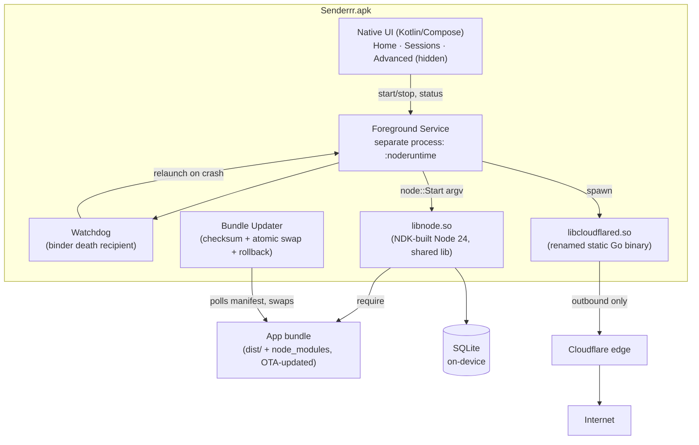

# PRD — Senderrr Native Android App (NDK Runtime Shift)

**Status:** Draft, pending approval per CLAUDE.md §2.5 ("get approval before major changes — new
dependencies, schema changes, restructuring — before implementing them, not after").
**Owner:** Aadesh Gurav.
**Supersedes/extends:** `claude/senderrr-on-android-phone-plan.md` ("Route C") — this document
turns that route's summary into an executable, commit-by-commit plan. Read that doc first for the
Route A/B/C comparison and the RAM/feature ledgers; this PRD does not repeat them except where a
number changed after research.
**Governing standard:** `CLAUDE.md` (attached to this project). Every phase and commit below is
built to satisfy it — §2 (plan before code), §4.3 (Strangler Fig), §5 (300-line file ceiling), §7
(secrets), §9 (branch discipline, zero-touch setup, real device in the loop), §10 (dependency
discipline), §15 (docs + commit discipline), §16 (Definition of Done), §18 (changelog, ADRs).
Section references below point back to it.

---

## 1. What this is, in one paragraph

Senderrr currently runs on a server (Docker) or, per the newly-shipped `ANDROID_SETUP.md`, on a
phone via Termux. This PRD covers the next step already agreed in conversation: a real Android
app — still named **Senderrr** — that embeds a cross-compiled Node.js runtime directly (Route C's
"APK + Baileys" path), so a non-technical client installs one APK, taps a few permission prompts,
and has a 24/7 WhatsApp automation server running on their own phone with no Termux, no `adb`, no
terminal literacy required. The terminal/log view still exists, but behind an **Advanced**
screen with an explicit warning, never the primary UI — this was an explicit decision in
conversation and is carried into this plan as ADR-8.

**This is a multi-week, multi-phase build.** It is being planned in full now, before any of it is
implemented, per §2's requirement to formulate a plan for anything architectural before writing
code — this document *is* that plan, submitted for approval before Phase 2 starts.

---

## 2. Goals

- One APK, sideloaded (not Play Store — see ADR-7), turns a stock Android phone into a running
  Senderrr instance with zero command-line interaction for the end client.
- No feature loss relative to the Baileys engine already shipped on `feat/baileys-engine-adapter`
  — the app is a new *deployment vehicle* for the same NestJS application, not a rewrite of it.
- The app updates its own application code (the compiled bundle + `node_modules`) automatically,
  without an APK re-install, whenever a new version is published — the "shell vs. bundle" split
  from the architecture discussion. An APK re-install is only needed when the *shell* itself
  changes (Node version bump, new native permission, Android API bump).
- Source stays available to every client per GPLv3, distributed manually/physically rather than
  via a public GitHub repo (ADR-7) — this was an explicit decision and changes how the release
  process works, not just where code lives.
- Every change lands as a small, individually reviewable commit with a name and description a
  reviewer can understand without reading the diff first (§15) — this PRD's phase breakdown in
  §7 is written at that granularity on purpose.
- The client's data survives phone loss/damage/theft: a daily, client-scheduled backup of the
  on-device database to the client's own Google Drive, using the Google account and Play Services
  already present on the phone (ADR-9) — added per client request, §11.
- The client can get a complete, non-technical picture of one advertising campaign — the campaign
  itself, every broadcast it ran, and every message's delivery outcome — as a single Excel file,
  rather than having to ask for that data assembled by hand (ADR-10) — a longstanding client
  request that the current schema makes genuinely awkward to fulfil today; see ADR-10 for why.

## 3. Non-goals

- Play Store distribution (ADR-7 explains why).
- Multi-device/multi-phone clustering. One phone runs one Senderrr instance; horizontal scaling
  is explicitly a "lost" feature versus the server deployment, per the existing project doc.
- Rewriting the NestJS application, its REST API, or the dashboard. This project changes *where
  and how the app runs*, not what it does.
- Solving the Baileys ban-risk soak or the link-preview parity work — both already handled on
  `feat/baileys-engine-adapter` (commits `88eedbe`, and the adapter itself). This PRD assumes that
  branch is functionally complete and focuses purely on the native shell around it.

---

## 4. Architecture overview

Four independently-versioned layers, matching the "shell vs. bundle" split from the architecture
discussion:

1. **Shell** (APK) — Kotlin UI, the foreground service, the watchdog, the updater, and the
   NDK-built native libraries (`libnode.so`, `libcloudflared.so`). Changes rarely; requires a new
   APK build and reinstall (or an in-app APK-update flow — open question, §9).
2. **Runtime** (`libnode.so`) — the compiled Node binary itself. Versioned with the shell because
   it's an NDK build artifact, not something the OTA updater can safely swap at runtime.
3. **Bundle** — the compiled Senderrr application (`dist/` + `node_modules`), exactly what CI
   already produces for the Docker/Termux deployments. This is what the OTA updater polls for and
   swaps — most releases only touch this layer.
4. **Data** — the on-device SQLite databases (main + data) and Baileys auth creds. Never
   overwritten by an update; migrated in place by TypeORM's existing migration runner.

---

## 5. Architecture Decision Records

Each ADR: context, decision, alternatives considered, consequences — per §15/§18.1's ADR format.

### ADR-1 — WhatsApp engine: Baileys (already decided, recorded for completeness)

**Context:** whatsapp-web.js requires a real Chromium per session; Chromium is glibc-linked and
Android is bionic, so no engine swap means no viable Android path at all (see the existing project
doc's "why an APK doesn't fix Chromium").
**Decision:** Baileys, a pure-Node WhatsApp multi-device client. Already implemented on
`feat/baileys-engine-adapter`.
**Alternatives considered:** Building Chromium from source for an Android `headless_shell`
target — rejected, weeks of build engineering plus permanent maintenance for a browser we don't
need features from. Android system WebView (Route B) — rejected as the default because it still
needs an NDK-built Node for the server side *and* a browser-injection port of the existing CDP
tricks, for no RAM/complexity win over Baileys; kept as a fallback only if Baileys is later found
to miss something the client depends on.
**Consequences:** every existing WhatsApp number must re-pair (§ risk register); Labels/Catalog/
Channels/Status coverage is thinner until proven needed.

### ADR-2 — Deployment vehicle: native APK with embedded Node (Route C), not Termux, not WebView

**Context:** Three routes were compared (existing project doc): Termux+proot (A), APK+WebView (B),
APK+Baileys (C). A ships today (`ANDROID_SETUP.md`) as the fast interim path. This PRD is about
building C.
**Decision:** Route C — a native Android app that embeds a cross-compiled Node runtime directly,
no Termux, no proot, no `adb`.
**Alternatives considered:** Shipping "fragments of Termux" inside a wrapper app (raised in
conversation) — rejected once Route C's NDK path was confirmed workable, because it would still
carry Termux's bootstrap/package-manager complexity and its `termux-exec` W^X shim for no benefit
once Node itself can be NDK-built and embedded directly as a shared library.
**Consequences:** Route A (`ANDROID_SETUP.md`) stays published and supported as the fast/interim
option — per §4.3's Strangler Fig principle, we don't delete a working path while building its
replacement. The two are documented as separate, independently-usable deployment methods, not a
transition where one silently replaces the other on a deadline.

### ADR-3 — Node build method: mirror Termux's own `--dest-os=android` recipe, not nodejs-mobile

**Context (researched for this PRD, not assumed):** Two candidate approaches exist for producing
an Android-runnable Node build:
1. **nodejs-mobile / JaneaSystems** — a maintained fork with prebuilt Android/iOS embedding
   scaffolding (JNI sample projects, an `android-configure` variant, Android patches).
   **Verified via research:** its latest release is versioned against **Node 18.20.4** (Oct 2024)
   — nodejs-mobile tracks Node's ABI one major behind and has not moved to Node 20+. NestJS 11
   requires Node ≥20, so this path is a hard blocker, not a preference.
2. **Node's own upstream `--dest-os=android` support**, invoked exactly the way Termux's own
   `nodejs-lts` package does it today. **Verified via research:** Termux's current `nodejs-lts`
   package builds **Node 24.18.0** using plain upstream `./configure --dest-os=android
   --cross-compiling ...` flags (plus a header patch so `node-gyp` targets the patched headers,
   and an `aligned_alloc=memalign` shim only needed below API 28) — no fork, no stale ABI ceiling,
   actively maintained by a large, security-conscious packaging project.
**Decision:** Build our own `libnode.so` from **upstream Node's official source tree**, using the
same `--dest-os=android --cross-compiling` configure path Termux uses, adapted with `--shared`
and `LDFLAGS=-shared` to produce a shared library instead of the `node` executable Termux ships.
Track Termux's `nodejs-lts/build.sh` as a living reference for flags and API-level shims — it is
actively maintained against current NDK/Node releases, which a 2016-era standalone blog
walkthrough (also reviewed for this PRD) is not.
**Alternatives considered:** nodejs-mobile (blocked on Node version, above). Building from a
frozen historical recipe (the 2016 walkthrough) verbatim — rejected; several of its workarounds
(manual SONAME patching, x86-host `mkpeephole` cross-build) are NDK-r13b-era and must be
re-verified against the current NDK before being carried forward, not assumed still necessary.
**Consequences:** this is real build-engineering work with no drop-in solution — Phase 2 opens
with a **spike commit** (§7) whose only job is producing a working `libnode.so` and proving
`node::Start()` runs a "hello world" script from it, before any app code is written around it.

**Verified during implementation (amends this ADR with what the build actually needed):**
- **Node 24.20.0**, the current 24.x LTS, rather than the 24.18.0 Termux was on when this was
  written — same line, same configure surface. NDK **r28c (28.2.13676358)**, pinned in both the
  build image and `android/app/build.gradle.kts` so the app and the runtime it loads come from
  one toolchain.
- **The SONAME patching the 2016 walkthrough needed is unnecessary.** Node's own `configure.py`
  sets a plain `.so` suffix for `dest-os=android` and emits `libnode.so` directly from
  `--shared`. Flagged above as needing re-verification; re-verified, and dropped.
- **The build must run on Linux, not on the developer's machine.** gyp's make generator emits
  GNU-linker flags (`--start-group`, `-soname`) for the *host* tools V8 builds along the way,
  and Apple's linker rejects them outright — a macOS host cannot finish the build at all, which
  is also why Termux's reference recipe is a Linux one. `scripts/build-libnode.sh` therefore
  drives the build inside a pinned Linux image, which has the side benefit of making the build
  identical for every developer and for CI. It is `linux/amd64` because Google ships no
  aarch64-Linux NDK.
- **The make generator, not ninja** (which Termux uses). gyp's ninja generator emits duplicate
  rules for V8's inspector stamp when host and target toolsets are both in play — exactly what a
  cross build does — and fails outright; make handles the dual toolset and only warns.
- Two configure flags are ours rather than Termux's: `--without-node-snapshot`, because
  generating the V8 startup snapshot means running a target binary a cross build cannot run, and
  `--without-npm --without-corepack`, because the phone ships a prebuilt bundle and never
  installs a package.

### ADR-4 — Node runs in its own Android process, supervised by a watchdog

**Context (researched for this PRD):** Documented real-world experience embedding Node in Android
(the sisik.eu embedding guide, independently reviewed) states plainly that "Node's process
lifecycle management doesn't fit completely with Android's way of managing app processes" and
that Node may attempt direct process termination on error, bypassing Android's lifecycle
controls entirely. Today's Termux deployment gets equivalent supervision for free from `pm2`
(`pm2 resurrect`, automatic restart on crash); an in-process embed has no equivalent unless we
build one.
**Decision:** The foreground service that hosts `node::Start()` runs in its own Android process
(`android:process=":noderuntime"` in the manifest), isolated from the UI process. The UI process
binds to it and registers a binder death recipient; if the `:noderuntime` process dies for any
reason (including Node calling `exit()` internally), the UI process detects the death and
restarts the service, mirroring what `pm2 resurrect` does today.
**Alternatives considered:** running Node in the same process as the UI — rejected outright per
the cited risk: a Node-side crash would take the whole app down, including the UI the client
needs to see status.
**Consequences:** adds one moving part (the watchdog) that needs its own test coverage (§8) and
its own log line when it fires, per §8's observability rule ("errors never pass silently").

### ADR-5 — Data layer: attempt native SQLite cross-compile first; WASM SQLite is the fallback, not the default

**Context (researched for this PRD):** Cross-compiling native Node addons (`sqlite3`,
`better-sqlite3`) against an NDK/Android target is a real, recurring pain point — multiple open
issues exist against exactly this (`sqlite3` needing an `android_ndk_path` env var under Termux's
own Node package; `better-sqlite3` arm64 breakage reports). It is not unsolved, though: a
maintained fork (`better-sqlite3-nodejs-mobile`) and a general-purpose tool
(`prebuild-for-nodejs-mobile`) exist specifically to prebuild native addons against a
mobile-embedded Node ABI, proving the approach is viable, just fiddly and ABI-version-sensitive.
**Decision:** Phase 4 opens with a **spike/decision-gate commit**: attempt cross-compiling
`better-sqlite3` (the project's current driver — confirm in Phase 4, §7) against our Phase 2
`libnode.so`'s exact Node ABI, following the `prebuild-for-nodejs-mobile`-style toolchain. If it
builds and passes the existing TypeORM SQLite test suite unmodified, ship it — this preserves the
sync API and performance characteristics the ORM layer already assumes. If it doesn't build
cleanly within a fixed, time-boxed spike (one week), fall back to a WASM SQLite build (e.g.
`wa-sqlite` or `sql.js` behind a TypeORM driver shim) — slower, but immune to Android ABI/NDK
version churn entirely, since WASM runs identically regardless of the host architecture.
**Alternatives considered:** Postgres — ruled out already in the existing project doc (Postgres
can't run on bionic without proot, which this PRD's whole point is to avoid).
**Consequences:** this is the one open technical risk in the plan with a real chance of forcing a
driver-layer change; §7 sequences the spike as early as possible in Phase 4 so a "must fall back
to WASM" finding doesn't surface late.

### ADR-6 — OTA updates: shell/bundle split, checksummed, health-check-gated rollback

**Context:** the client must never need this repo's `git pull` + rebuild cycle. Most releases
(campaign features, bug fixes, dependency bumps within the same Node major) only touch application
code, not the native shell.
**Decision:** Two independent update channels:
- **Bundle updates** (the common case): the app polls a JSON manifest (`{version, url, sha256}`)
  on a timer, downloads the new `dist/` + `node_modules` tarball when the version differs,
  verifies the checksum, extracts to a staging directory, and atomically swaps it in (rename, not
  copy-over-live) on the next service restart. The service performs a **health check** (the
  existing `/health` endpoint) after swap; if it fails to return healthy within a bounded timeout,
  the updater automatically rolls back to the previous bundle directory and reports the failure
  (§8 — errors never pass silently) rather than leaving the client on a broken build.
- **Shell updates** (rare): a new APK, distributed the same way the initial install was (manual/
  physical per ADR-7) or via an in-app "check for shell update" prompt that opens the APK file
  for the user to confirm-install — Android disallows silent self-updating outside Play Store, so
  this step always needs one tap from whoever has physical access to the phone.
**Alternatives considered:** shipping every change as a new APK — rejected, defeats the entire
point of the shell/bundle split and would require a client to reinstall for every bug fix.
**Consequences:** the update manifest and its hosting location is new infrastructure (needs a
home — likely a small endpoint on the existing server deployment, so one Senderrr instance can
serve update manifests to the fleet of phone instances) — sequenced as its own commit set in
Phase 5, §7.

### ADR-7 — Distribution: sideload only, GPLv3 source shared manually per client, not via public GitHub

**Context:** already decided in conversation. A WhatsApp-automation app running a persistent
background server would not survive Play Store review, and the business decision was to keep the
source privately distributed rather than public.
**Decision:** APK is sideloaded (client enables "install from unknown sources" once, guided by
the setup docs, same UX pattern as the existing `ANDROID_SETUP.md`'s Termux/F-Droid install step).
Source code is provided to each client as a physical/manual handoff (e.g. a copy on a drive or a
private, non-GitHub transfer) rather than a public repository — this satisfies GPLv3's
source-availability obligation to *recipients* of the binary without making the repository public.
**Alternatives considered:** a private GitHub repo with per-client collaborator access — viable
and GPLv3-compliant too, but rejected per the explicit stated preference to keep distribution
manual/physical.
**Consequences:** the release process needs a documented step ("hand the client a current source
snapshot with this build") — added to §7's Phase 6 checklist so it isn't an afterthought at
ship time.

### ADR-8 — Terminal/advanced access: present, but demoted to a warned Advanced screen

**Context:** explicit decision in conversation — don't remove the ability to see what's actually
happening under the hood (logs, raw state), but don't make it the primary interface a
non-technical client sees.
**Decision:** The native UI's default surface is Home (status, start/stop, pairing) and Sessions.
A separate **Advanced** screen — reached via an explicit "Advanced" entry, not a default tab —
shows a live tail of the service's stdout/stderr (the same stream the sisik.eu embedding pattern
captures via `pipe()`/`dup2()` into logcat) plus raw config values, gated behind an interstitial
warning ("Only use this if you know what you're doing — changes here can break your server").
There is no full interactive shell into the embedded Node process in v1 — a read-only log tail
plus a small set of clearly-labeled diagnostic actions (restart service, clear bundle cache, copy
logs) covers the "terminal, but hidden and warned" intent without the security surface of a real
remote shell on a client's phone.
**Alternatives considered:** a real interactive terminal (true Termux-style shell) behind the
Advanced screen — deferred, not rejected outright: revisit once v1 is stable if support burden
shows a real shell would help more than the risk of a client fat-fingering something costs.
**Consequences:** none of the Phase 2 UI commits build a shell; "log tail + diagnostics" is the
v1 scope for Advanced, called out explicitly so it isn't quietly re-scoped mid-build.

### ADR-9 — Daily database backup to the client's own Google Drive

**Context:** client request — since the app runs on Android, it can use the Google account
already signed into the phone (Play Services/GAPPS) rather than asking the client to manage their
own off-device backup storage. This extends Phase 4's "nightly DB dump off-device" (commit 21),
which already establishes *that* a dump happens; ADR-9 is about *where it goes* and *how consent
and scheduling work*.

**Decision, researched rather than assumed:**
- **Sign-in and authorization are two separate steps, using current (non-deprecated) Google
  APIs.** Google's own guidance is explicit that the legacy `GoogleSignInClient`/
  `GoogleSignInOptions` API is deprecated for new work. The current split: **Credential Manager**
  for authentication (who is this), and a separate **`AuthorizationClient`** call
  (`Identity.getAuthorizationClient(activity).authorize(...)`) for the specific Drive scope,
  requested only when the client actually enables backup in Settings — not bundled into a generic
  sign-in step nobody asked for (this is also §11.1 heuristic 5, error prevention through good
  defaults, and Google's own stated rationale: "avoid overwhelming new users… as to why they are
  being asked for certain permissions").
- **Scope: `drive.file`, with a visible, named app folder ("Senderrr Backups") — not the hidden
  `appDataFolder`.** Researched both: `appDataFolder` is completely hidden from the user in the
  Drive UI, can't be shared, and can't be browsed or downloaded except through the app itself.
  For a technical/ops backup that's the more common default (no clutter in the user's Drive), but
  for *this* client — a business owner who explicitly asked to see this data protected — an
  invisible backup they can never independently verify, download, or hand to a bookkeeper is a
  worse fit: it satisfies §18.2's "doesn't lose their data" on paper while failing §11.1 heuristic
  1 (visibility of system status) in practice, since nothing in the Drive UI itself ever confirms
  the backup is real. A visible `drive.file`-scoped folder costs nothing extra to implement and
  lets the client see file names, sizes, and dates directly in their own Drive app as independent
  proof it's working.
- **The interactive consent step is native (unavoidable — Google's consent screen needs an
  Activity); the recurring backup itself is a plain NestJS scheduled job, not a native Android
  scheduler.** `AuthorizationClient`'s offline-access flow yields a one-time server auth code,
  which the native Settings screen hands to the already-running Node backend over `localhost`;
  Node exchanges it for a refresh token once and stores it itself. From then on, backup is just
  another job for `@nestjs/schedule` — **already a project dependency** (`package.json`,
  `@nestjs/schedule@^6.1.3`) — using its `SchedulerRegistry` to add/replace a single cron job at
  the time-of-day the client picks in Settings, persisted as a plain (non-secret) row in the
  existing `runtime_settings` key/value table (`database/entities/wa-automation/
  runtime-setting.entity.ts` — already exists, already the right place for this, no new table).
  **Android's `WorkManager` is deliberately not used here**: WorkManager exists to run work
  reliably when your process *isn't* continuously alive, which doesn't describe this app — Route
  C's entire premise (ADR-2) is a Node process running 24/7 in a foreground service, so an
  in-process cron job is simpler and already the pattern the rest of the scheduled/background work
  in this codebase uses (anti-ban pacing, broadcast dispatch). Reaching for WorkManager anyway
  would be exactly the kind of unjustified pattern §4.1/§4.5 warns against adopting without a
  concrete failure it answers.
- **The refresh token is a secret and is stored like one, not like the time-of-day setting next to
  it.** Google's own guidance for this exact flow states refresh tokens "should be stored securely
  on the backend server only" — here, the phone's own Node process *is* that backend server, so
  the token goes into the same Android Keystore-backed encrypted store already planned for the
  Cloudflare Tunnel token (Phase 3, commit 16), never into `runtime_settings.value` in plaintext
  next to the non-secret backup-hour setting (§7 — no secrets in source or in an unencrypted
  app-private file).
- **Upload via a direct, minimal call to the Drive REST v3 `files.create` (multipart) endpoint
  using `axios`** (already a project dependency), not the full `googleapis` Node SDK — the surface
  needed (refresh an access token, upload one file to one folder on a timer) is narrow enough that
  pulling in Google's large, general-purpose SDK is a dependency-weight decision that doesn't pay
  for itself here (§10 — "every new dependency is a decision, not a default"). Revisit if the
  manual implementation proves fragile in practice.

**Alternatives considered:** Android's system-level "Back up my data" (Auto Backup for Apps) —
rejected; it backs up app state for app *reinstall/device-transfer* scenarios, isn't
client-schedulable to a specific time, and doesn't produce a file the client can see or hand to
someone else. `appDataFolder` scope — rejected above for hiding the evidence backups work.
WorkManager-driven upload — rejected above as solving a problem (surviving process death) this
app's own architecture (ADR-2, ADR-4) already doesn't have.

**Consequences:** requires Google Play Services on the device — the large majority of
consumer/business Android phones, but not a de-Googled or Huawei-without-GMS device. Per §4.6
graceful degradation: if Play Services or Google Sign-In isn't available, the existing local
nightly dump (commit 21) still runs unaffected, and Settings tells the client plainly that
Drive backup isn't available on this device rather than failing silently or crashing. New
dependencies: none on the native side beyond `play-services-auth` (already the standard way to do
any Google sign-in on Android); on the Node side, none beyond what's already in `package.json`
(`axios`) for the REST calls — no `googleapis` SDK, no new scheduler package.

### ADR-10 — Unified Excel export for campaign + broadcast + delivery data

**Context:** longstanding client request — export one advertising campaign's data as an Excel
file. Investigated the actual schema (not assumed) before designing this, per §2's "index the
relevant parts of the codebase… don't guess at structure — look":

- An advertising campaign is an `Advertisement` (`advertisements` table: title, body, target type,
  status, package days/days used), with its own `AdTemplate` rows and `MediaAttachment`s.
- Delivery activity lives three tables away and **is not enforced as a relation to the
  campaign**: `BroadcastEvent` (`broadcast_events`) — one row per send-out — carries
  `advertisementId`/`advertisementTitle` as **nullable, denormalized columns**, not a
  `@ManyToOne(() => Advertisement)` foreign key. From there, `MessageTask` (`message_tasks`) has a
  real FK to `BroadcastEvent` and to the target `WhatsAppGroup` (one row per group a broadcast was
  sent to — status, `waMessageId`, error category/message, attempt count), and `MessageAttempt`
  (`message_attempts`) has a real FK to `MessageTask` (one row per retry — attempt number, status,
  error, response time). This is precisely the "scattered, not in the same table" problem
  described: a campaign's full picture is a four-table join, and the weakest link
  (`advertisementId` on `broadcast_events`) isn't even a real foreign key today.
- `BroadcastEvent` can optionally reference a `ScrapedArticle` — relevant here because this
  client's actual usage pattern (per the link-preview work already shipped) is broadcasting
  scraped news articles, so the article's title/URL belongs in the export alongside the message
  text, not as an afterthought.

**Decision:**
- **Ship the export as a real API endpoint** (`GET /v1/advertisements/:id/export.xlsx`, per §4.7's
  contract — a noun-based resource route, not `/exportCampaignData`), not a client-side/dashboard
  computation — the join spans four tables and hundreds to thousands of rows for an active
  campaign, which belongs server-side.
- **Four sheets, ordered from summary to detail, matching how a non-technical business user
  thinks about "a campaign" rather than the raw table names (§11.1 heuristic 2, match the real
  world):**
  1. **Campaign Summary** — one row: title, status, target type, package days/days used, template
     count, total broadcasts, total sent/failed across all its broadcasts.
  2. **Broadcasts** — one row per `BroadcastEvent`: article title/link (if present), message text,
     status, sent/failed counts, started/completed timestamps.
  3. **Message Log** — one row per `MessageTask`: which broadcast, which group, delivery status,
     WhatsApp message id, attempt count, last attempt time, error category/message if failed. This
     is the sheet that answers "did group X actually get it."
  4. **Retry Detail** (opt-in, off by default) — one row per `MessageAttempt`, for when someone
     needs the full retry-by-retry trail. Off by default per Hick's Law/§11.1 heuristic 8: most
     requests for "the campaign data" mean sheets 1–3, and a busy campaign's attempt-level detail
     can run to tens of thousands of rows — showing it unconditionally would bury the sheet people
     actually want.
- **`exceljs`, not `xlsx`(SheetJS) or `node-xlsx`.** Researched current (2026) status of all
  three: SheetJS has the widest format support but "limited" styling; `node-xlsx` has none;
  `exceljs` is purpose-built for exactly this — a formatted, multi-sheet report with headers,
  column widths, and number/date formatting — and remains actively maintained (~1.9M weekly
  downloads). This is a new dependency (§10) — justified because none of the project's existing
  dependencies cover spreadsheet generation, and the styling requirement rules out the two
  lighter alternatives.
- **Single-campaign export runs synchronously**; a future "export all campaigns in a date range"
  request (not asked for yet, noted for later) should reuse the project's existing
  job-id-plus-Socket.IO-report pattern already used for other long operations (the broadcast
  dispatcher), rather than inventing a second async-job mechanism.
- **A broadcast row that doesn't match any campaign (possible today precisely because there's no
  enforced FK) is never silently dropped from the export** — per §8 ("errors never pass silently"),
  it's surfaced as its own "Unlinked broadcasts" row set rather than vanishing, so a data-integrity
  gap shows up as a visible anomaly the client can ask about, not a quietly incomplete report.
- **Flagged, not silently fixed: the missing FK between `broadcast_events.advertisementId` and
  `advertisements.id`.** The export's join can work against the existing loose columns as-is,
  but a proper foreign key (plus a migration to backfill/validate existing rows) would make this
  data integrity guarantee real instead of conventional. That's a schema change and gets its own
  approval per §2.5 rather than being bundled invisibly into the export feature — listed as an
  open question, §9.

**Alternatives considered:** building the export as a dashboard-side (React) computation over
several existing REST calls — rejected, the join and row counts belong server-side, and a
client-side approach would need to fetch every table fully to reconstruct joins the database
already knows how to do. Including retry-level detail unconditionally — rejected per Hick's Law
above.

**Consequences:** this feature is genuinely independent of the Android/NDK work in the rest of
this PRD — it's a backend/dashboard change that works identically on the current Docker/Termux
deployments and the future native app. It's included here because it was requested alongside the
Drive-backup work, not because it depends on or blocks the Android phases; it can ship on its own
timeline (§7, Phase 8).

---

## 6. Risk register

| Risk | Likelihood | Impact | Mitigation |
|---|---|---|---|
| Node's in-process lifecycle conflicts with Android's (ADR-4's cited risk) | Medium | High — silent app death | Separate `:noderuntime` process + watchdog (ADR-4); Phase 2 spike must specifically test a forced Node-side crash |
| Native SQLite addon won't cross-compile cleanly against our exact Node ABI | Medium | Medium — forces WASM fallback | Time-boxed spike gate in Phase 4 (ADR-5), fallback path pre-planned, not discovered late |
| OEM battery managers kill the foreground service despite the exemption prompt | Medium | High — client thinks it's running, it isn't | External heartbeat/dead-man's-switch monitor (already planned in the existing project doc) ships in Phase 5, not deferred indefinitely |
| NDK/Node version drift vs. Termux's reference recipe over time | Low–Medium | Low — build breaks on next Node bump | Pin exact NDK + Node versions (§10); document the Termux `build.sh` diff-check step as part of any future Node version bump |
| GPLv3 compliance gap in manual distribution process | Low | High — legal | Phase 6 checklist item makes "hand over current source" an explicit, non-skippable release step (ADR-7) |
| Ban-risk under Baileys at scale | Unknown (carried over) | High | Already flagged in the existing project doc; unchanged by this PRD — soak plan in Phase 6 |
| Battery degradation from 24/7 charging | Certain, slow | Low–Medium | Charge-limit setting or smart plug, budget a phone battery replacement (unchanged from existing doc) |
| Client's phone has no Google Play Services (de-Googled, some Huawei models) | Low | Medium — no Drive backup | Local nightly dump (Phase 4, commit 21) still runs regardless; Settings states plainly that Drive backup isn't available on this device (ADR-9) |
| Manual Drive REST integration (no `googleapis` SDK) misses an edge case the SDK would have handled | Low–Medium | Low — retried on next scheduled run | One backup a day means a single failed run is not data loss (the local dump still exists); revisit the SDK if failures recur (ADR-9) |
| `broadcast_events.advertisementId` has no enforced FK — a row could reference a deleted/wrong campaign | Low | Medium — export could join to nothing or the wrong campaign | Export handles a missing match by showing the row under "Unlinked broadcasts" rather than dropping it silently (§8); formal FK is a separate, explicitly-approved schema change (ADR-10, open questions) |

---

## 7. Phased roadmap — commits

Every commit below is sized to be independently reviewable: one coherent change, a name a
reviewer can act on without opening the diff, a description of *why*, and an explicit way to
verify it before moving to the next one (§6 "new logic gets tests," §15 "commit small and
often"). **Per §15/§16, every commit that changes user-visible or operator-visible behavior
updates this PRD, the CHANGELOG, and the relevant setup guide in the same commit — not as a
follow-up.** Phase 0/1 are already done; they're listed for continuity.

### Phase 0 — Engine swap (done)

- `feat(engine): add Baileys engine adapter` — `7554bf5`.
- `feat(baileys): wire native link-preview support into warmUpLinkPreview` — `88eedbe`.
- `docs: add Android/Termux setup guide, automated setup script, and README` — `215cde5`.

### Phase 1 — Planning (this document)

1. **`docs(arch): add NDK migration PRD`** — this file. Verification: reviewed and approved by
   Aadesh before Phase 2 opens (§2.5 gate).
2. **`docs: add CHANGELOG.md`** — seeds a Keep-a-Changelog-format log with everything shipped so
   far, so Phase 2 onward has somewhere to record itself from commit one.
3. **`docs: cross-link PRD and changelog from README/ANDROID_SETUP`** — discoverability, §15.

### Phase 2 — Android shell + embedded Node (the spike-heavy phase) — code complete, pending on-device verification

4. **`spike(ndk): cross-compile libnode.so and run a hello-world script`** — *not* app code; a
   standalone build script + a throwaway instrumented test app that loads `libnode.so` and runs
   `console.log('hello from libnode')`. This is ADR-3's proof-of-concept and gates every commit
   after it. Verification: the log line appears on a real device (§9 "real device in the loop").
5. **`build(ndk): document and pin the Node/NDK build toolchain`** — turns the spike's manual
   steps into a repeatable `scripts/build-libnode.sh`, pins exact NDK and Node versions (§10 —
   "pin versions deliberately, know why"), records the flags diffed against Termux's
   `nodejs-lts/build.sh` as of this commit's date.
6. **`feat(android): scaffold the Senderrr Android app shell`** — empty Gradle/Kotlin project,
   package id, `minSdk` set to 28 (chosen to skip the `aligned_alloc` shim ADR-3 found is only
   needed below API 28), app icon/name. No Node yet. Verification: builds and installs a blank
   app on a real device.
7. **`feat(android): JNI bridge to node::Start()`** — the native C++ glue calling `node::Start()`
   with an argv built from the bundle path, following the pattern researched for ADR-4/ADR-3.
   Verification: instrumented test launches the bridge and asserts the hello-world script's
   output reaches logcat.
8. **`feat(android): foreground service hosting the Node runtime in its own process`** —
   `android:process=":noderuntime"`, persistent notification, wake lock. Verification: service
   survives the app being swiped away from Recents (the exact failure mode Termux needs
   Termux:Boot + battery exemption to work around).
9. **`feat(android): watchdog + binder death recipient`** — implements ADR-4's crash-restart
   loop. Verification: a test build that force-kills the `:noderuntime` process from `adb shell`
   and asserts the UI detects it and restarts the service within N seconds.
10. **`feat(android): bundle loader (extract dist/ + node_modules from assets to app storage)`**
    — first-run path only; OTA swap logic is Phase 5. Verification: the actual Senderrr `dist/`
    bundle runs inside the embedded runtime and `/health` responds on `localhost` from the
    phone's own browser (mirrors the existing project doc's Phase 2 acceptance test).
11. **`feat(android): boot receiver + battery-exemption prompt flow`** — `RECEIVE_BOOT_COMPLETED`
    relaunches the service; an in-app prompt requests
    `REQUEST_IGNORE_BATTERY_OPTIMIZATIONS` instead of the manual Settings navigation
    `setup-android.sh` currently automates for Termux. Verification: reboot the test device,
    confirm the service is back up with no manual step.
12. **`feat(android): Home screen (status, start/stop, pairing code display)`**. Verification:
    §11.6.9's mobile checklist run against a real mid-range device, not just the emulator (§9).
13. **`feat(android): Advanced screen — warned log tail + diagnostics`** — implements ADR-8's v1
    scope exactly (log tail, restart, clear cache, copy logs — no shell). Verification: the
    warning interstitial is unskippable without an explicit confirm tap; log tail shows live
    Node stdout/stderr.
14. **`docs: update PRD + CHANGELOG + add a v1 Android app section to ANDROID_SETUP.md`** —
    closes out Phase 2 per the "every phase updates docs" rule.

**Phase 2 status.** Commits 4-14 are written and the app builds, lints clean and installs. Every
*verification* step above is still outstanding, because all of them need a real phone attached:
the hello-world log line (4), the crash-and-restart test (9), `/health` answering on localhost
(10), the reboot test (11), and the mobile checklist (12-13). `NodeRuntimeTest` encodes the first
of these and runs with `./gradlew :app:connectedDebugAndroidTest`. Two additions to the plan that
came out of building it, recorded here rather than left implicit: the runtime's working directory
is deliberately kept **outside** the bundle directory, with relative symlinks into it, so an OTA
swap (ADR-6) renames one directory without the client's data in the blast radius; and
cross-process runtime state moves through a small file the runtime writes and the UI watches,
rather than a bound AIDL interface — one writer, one reader, and a value that survives either
process restarting.

### Phase 3 — Tunnel + dashboard reachability

15. **`build(cloudflared): package cloudflared as a native lib and verify the W^X exec path`** —
    confirms the same "compiled binary shipped as `lib*.so` under the app's native-lib directory"
    trick Android's own W^X exemption allows for anything under `applicationInfo.nativeLibraryDir`
    (the mechanism Termux itself relies on) — verification: `libcloudflared.so` executes from
    within the app sandbox and prints its version.
16. **`feat(android): tunnel lifecycle tied to the foreground service`** — start/stop the tunnel
    alongside Node; read the Cloudflare token from Android Keystore-backed encrypted storage, not
    a plaintext file (§7 — no secrets in source or, here, in an unencrypted app-private file).
17. **`feat(android): public URL + pairing surfaced on Home screen`**. Verification: dashboard
    reachable from an external network over the printed URL; Socket.IO upgrade confirmed working
    through the tunnel (the existing project doc flags this as something to verify, not assume).
18. **`docs: update PRD + CHANGELOG + ANDROID_SETUP.md with the tunnel setup flow`**.

### Phase 4 — On-device data layer

19. **`spike(data): attempt native better-sqlite3 cross-compile against our libnode.so ABI`** —
    ADR-5's decision gate. Verification: existing TypeORM SQLite test suite passes unmodified
    against the cross-compiled addon inside the embedded runtime. **Decision point:** pass →
    continue to commit 20 as written; fail within the one-week timebox → commit 20 becomes a WASM
    SQLite driver shim instead, and this PRD gets amended with that outcome before proceeding
    (§15 — docs reflect reality, not the plan as originally written).
20. **`feat(data): wire the on-device SQLite path into app config`** — main + data DB paths point
    into app-private storage; confirms the Infrastructure dashboard page's existing
    `isDockerAvailable()`-style graceful-degradation pattern covers "no Docker on this deployment"
    (already noted as handled in the existing project doc).
21. **`feat(data): continuous auth-cred backup + nightly DB dump off-device`** — per §18.2 ("it
    doesn't lose their data" ranked as the single highest-value reliability property).
22. **`docs: update PRD + CHANGELOG with the final data-layer decision (native vs WASM)`**.

### Phase 5 — OTA updates + production hardening

23. **`feat(update): bundle-update manifest schema + polling client`** — ADR-6.
24. **`feat(update): checksum verify + atomic bundle swap`**.
25. **`feat(update): health-check-gated automatic rollback`** — verification: a deliberately
    broken bundle is pushed in a test channel and the device is confirmed to roll back on its own
    without manual intervention, logging why (§8).
26. **`feat(update): in-app shell/APK update check + confirm-install prompt`**.
27. **`ops: external heartbeat / dead-man's-switch monitor for the phone fleet`**.
28. **`docs: update PRD + CHANGELOG + ANDROID_SETUP.md with the update mechanism`**.

### Phase 6 — Soak, cutover, release process

29. Run the existing project doc's 72-hour soak plan (Render live, phone shadowing, watch RSS
    growth/overnight drops/flagged numbers) — operational, not a code commit.
30. Re-pair every client WhatsApp number in one sitting; move DNS; keep Render warm two weeks —
    unchanged from the existing project doc.
31. **`docs: write the client-facing release checklist`** — includes ADR-7's "hand the client a
    current source snapshot" step explicitly, so GPLv3 compliance is a checklist line item, not
    an afterthought.
32. **`docs: final PRD + CHANGELOG update marking the NDK app v1 shipped`**.

### Phase 7 — Google Drive backup (ADR-9; depends on Phase 4's data layer and Phase 3's
encrypted-token storage pattern; otherwise independent of Phases 5/6)

33. **`feat(android): Settings screen — "Connect Google Drive" via Credential Manager +
    AuthorizationClient`** — the one-time interactive consent flow (ADR-9); no scope requested
    until the client actually enables backup. Verification: consent screen shows only the Drive
    scope, not a bundle of unrelated permissions (§11.1 heuristic 5).
34. **`feat(data): exchange the one-time auth code for a refresh token and store it encrypted`** —
    Node-side; reuses the Keystore-backed secret store from Phase 3, commit 16. Verification: the
    plaintext refresh token never appears in `runtime_settings`, logs, or a crash dump (§7).
35. **`feat(data): daily Drive backup as an @nestjs/schedule cron job, time set in Settings`** —
    uploads the existing nightly dump (Phase 4, commit 21) to a visible "Senderrr Backups" Drive
    folder via a direct Drive REST v3 call. Verification: a real Google account shows the file
    appear in Drive at the scheduled time, with the correct name/timestamp, from a real device.
36. **`feat(android): backup status shown in Settings (last success time, last error)`** — §11.1
    heuristic 1, visibility of system status; a backup nobody can see happened isn't trusted.
37. **`feat(data): graceful degradation when Play Services/Drive is unavailable`** — local dump
    keeps running; Settings states plainly that Drive backup isn't available on this device (§4.6,
    ADR-9). Verification: tested on a Play-Services-less build/device, no crash, clear message.
38. **`docs: update PRD + CHANGELOG + ANDROID_SETUP.md with the Drive backup setup flow`**.

### Phase 8 — Campaign reporting: unified Excel export (ADR-10; independent of the Android work,
can ship on the current Docker/Termux deployments before or after Phase 2–7)

39. **`feat(reporting): add exceljs dependency and the export endpoint skeleton`** —
    `GET /v1/advertisements/:id/export.xlsx`, returns the Campaign Summary sheet only.
    Verification: opens cleanly in Excel/LibreOffice/Google Sheets with correct headers.
40. **`feat(reporting): Broadcasts and Message Log sheets`** — the four-table join described in
    ADR-10, including the "Unlinked broadcasts" handling for rows with no matching campaign.
    Verification: a manually-constructed test campaign with a mix of sent/failed/retried messages
    produces a file whose sheet 3 row count matches `message_tasks` exactly.
41. **`feat(reporting): opt-in Retry Detail sheet`** — off by default, one query param to include
    it. Verification: response size/time stays reasonable with the sheet excluded on a
    large-campaign fixture.
42. **`docs: update PRD + CHANGELOG + relevant API docs (docs/06-api-specification.md) with the
    export endpoint`** — per §4.7, the API spec is a first-class artifact updated in the same
    change that adds the endpoint, not left to drift.

---

## 8. Testing strategy (§6)

- **JS-side application code** — unchanged; the existing Jest suite (154 passing) runs exactly as
  it does today, since the NestJS app itself doesn't change, only its host process.
- **Native/Kotlin code** — Android instrumented tests (`androidTest`) for: the JNI bridge
  (commit 7), the watchdog's crash-and-restart behavior (commit 9), the bundle loader (commit 10),
  and the update/rollback flow (commit 25) — each named in §7 with its specific verification step
  so "tested" means something concrete per commit, not a generic checkbox.
- **Real-device requirement (§9):** every commit in Phase 2 and Phase 3 is verified on a real
  mid-range Android phone, not only an emulator — battery-exemption prompts, boot receivers, and
  foreground-service survival under OEM battery management are exactly the class of behavior
  emulators don't reproduce faithfully.
- **A bug fix gets a regression test** (§6) — applies going forward once Phase 2 code exists to
  regress.
- **Drive backup (Phase 7):** verified on a real device with a real Google account per §9's
  "real device in the loop" — Credential Manager/AuthorizationClient consent screens are Play
  Services UI that an emulator without Play Services can't reproduce.
- **Excel export (Phase 8):** the existing Jest suite gets a new spec asserting the join's row
  counts against a seeded fixture (campaign → broadcasts → tasks → attempts) match the source
  tables exactly, and that a broadcast with no matching campaign lands in "Unlinked broadcasts"
  rather than being dropped (§6 — "especially anything with a decision branch").

## 9. Open questions

- **Shell-update delivery mechanism** — in-app "download and prompt to install" vs. requiring the
  client to receive a new APK the same manual/physical way as the initial install. Leaning toward
  in-app prompt for convenience, but needs a decision before commit 26.
- **Exact `minSdk`** — proposed 28 in commit 6 to skip ADR-3's `aligned_alloc` shim; confirm this
  doesn't exclude phones the actual client base uses.
- **Update-manifest hosting** — likely a small endpoint on the existing server deployment, so one
  Senderrr instance serves manifests to the phone fleet; not yet designed.
- **Does the client use Labels, Catalog, Channels, or Status?** — carried over unanswered from the
  existing project doc; still gates how much of the Baileys adapter's stubbed surface needs
  filling in before Phase 6's cutover.
- **One client or a product?** — carried over; changes whether the ffmpeg/voice-note gap (existing
  project doc) is worth solving before v1 or after.
- **Should `broadcast_events.advertisementId` become a real foreign key?** — ADR-10 deliberately
  leaves this open rather than bundling a schema change into the export feature; needs its own
  §2.5 approval, including a migration plan for existing rows that may not cleanly match.
- **Is a visible "Senderrr Backups" Drive folder actually what the client wants**, or would they
  prefer the backup fully hidden from the normal Drive UI? ADR-9 reasons toward visible/trust, but
  this is a preference worth confirming directly rather than assuming.

## 10. Sources consulted for this PRD

- [Building Node.js for Android — sisik.eu](https://sisik.eu/blog/android/other/build-node-js-for-android) — historical (2016, Node 7.7.3/NDK r13b) `android-configure` walkthrough; flags reviewed, specific workarounds flagged as needing re-verification against current NDK (ADR-3).
- [Embedding Node.js Into an Android App — sisik.eu](https://sisik.eu/blog/android/other/embedding-node-into-android-app) — source for the `node::Start()` JNI invocation pattern and the Node/Android process-lifecycle mismatch cited in ADR-4.
- [nodejs-mobile/nodejs-mobile](https://github.com/nodejs-mobile/nodejs-mobile) — confirmed latest release tracks Node 18.20.4, ruling it out per ADR-3.
- [termux/termux-packages — nodejs-lts/build.sh](https://github.com/termux/termux-packages/blob/master/packages/nodejs-lts/build.sh) — confirmed current Termux Node package builds Node 24.18.0 via upstream `--dest-os=android --cross-compiling`, the reference recipe adopted in ADR-3.
- [termux/termux-packages Issue #19716 — sqlite3 requires android_ndk_path](https://github.com/termux/termux-packages/issues/19716) and [WiseLibs/better-sqlite3 Issue #771 — arm64](https://github.com/JoshuaWise/better-sqlite3/issues/771) — evidence for ADR-5's native-cross-compile risk.
- [digidem/better-sqlite3-nodejs-mobile](https://github.com/digidem/better-sqlite3-nodejs-mobile) and [staltz/prebuild-for-nodejs-mobile](https://github.com/staltz/prebuild-for-nodejs-mobile) — evidence that native SQLite cross-compilation for a mobile-embedded Node ABI is a solved-but-fiddly problem, informing ADR-5's spike-then-fallback structure.
- `claude/senderrr-on-android-phone-plan.md` (this project's own prior doc) — Route A/B/C
  comparison, RAM budgets, feature ledger, migration phase 0/1 — the basis this PRD extends.
- [Google — Store application-specific data (appDataFolder)](https://developers.google.com/workspace/drive/api/guides/appdata) — confirmed appDataFolder is fully hidden from the Drive UI and unshareable, informing ADR-9's choice of a visible `drive.file` folder instead.
- [Android Developers — Authorize access to Google user data](https://developer.android.com/identity/authorization) — confirmed `GoogleSignInClient`/`GoogleSignInOptions` are legacy; current guidance is Credential Manager (authentication) + `AuthorizationClient` (scoped authorization), requested on demand, with refresh tokens stored server-side — the basis for ADR-9's whole flow.
- [PkgPulse — SheetJS vs ExcelJS vs node-xlsx in Node, 2026](https://www.pkgpulse.com/guides/sheetjs-vs-exceljs-vs-node-xlsx-excel-files-node-2026) — confirmed `exceljs` remains actively maintained and is the styling-capable choice for a multi-sheet formatted report, informing ADR-10.
- This project's own entities (`database/entities/wa-automation/advertisement.entity.ts`,
  `ad-template.entity.ts`, `broadcast-event.entity.ts`, `message-task.entity.ts`,
  `message-attempt.entity.ts`, `runtime-setting.entity.ts`) and `package.json` — read directly
  (§2) to ground ADR-10's join design and confirm `@nestjs/schedule` was already a dependency
  before proposing ADR-9's scheduling approach.
- `CLAUDE.md` (attached) — governs every structural and process decision in this document.
